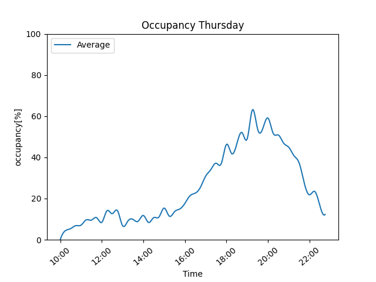
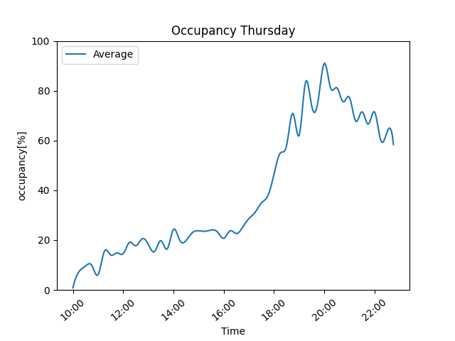

# Hi Studio Bloc-Fans,
this is a plot of the official Visitor-Numbers of  [Studio Bloc Darmstadt](https://darmstadt.studiobloc.de/) and [Studio Bloc Mannheim](https://mannheim.studiobloc.de/)

### Is it busy right now? 
| [Studio Bloc Darmstadt](https://darmstadt.studiobloc.de/) | [Studio Bloc Mannheim](https://mannheim.studiobloc.de/) | 
|:-:|:-:|
|<!-- BEGIN UPDATINGDATA BOARD Darmstadt-->41 out of 150 allowed visitors. --> 27% occupied! 17% more than average!<!-- END UPDATINGDATA BOARD Darmstadt-->|<!-- BEGIN UPDATINGDATA BOARD Mannheim-->26 out of 130 allowed visitors. --> 20% occupied! 4% more than average!<!-- END UPDATINGDATA BOARD Mannheim-->|
|<!-- BEGIN UPDATINGPNG BOARD Darmstadt--><!-- END UPDATINGPNG BOARD Darmstadt-->|<!-- BEGIN UPDATINGPNG BOARD Mannheim--><!-- END UPDATINGPNG BOARD Mannheim-->|

  
The average visitor data of the whole week

<!-- BEGIN UPDATINGDAYSPNG BOARD-->
| Darmstadt | Mannheim |
|:-:|:-:|
|||
|||
|||
|||
|||
|||
|||
<!-- END UPDATINGDAYSPNG BOARD-->

## It hasn't updated for a long time...
This is a GitHub-Issue with cron. They are aware of it and so am I. 
If you can't wait, [press here!](https://github.com/bloedboemmel/StudioBloc/issues/new?title=StudioBloc%3AUpdate%20Yourself%21&body=Please+do+not+change+the+title.+Just+click+"Submit+new+issue".+You+don't+need+to+do+anything+else+%3AD)

## Is this really the correct data?
Yes, it is the same data, which is used on their own websites, but a little more info!

## Wait! The average graph is the same like the now graph?!
Yes, that's for the first weeks till my bot collects more and more average-data

## What is planned for the future?
Also i'm planning to train an AI to predict the visitor-numbers depending on weather, user-data, holidays, events, etc.